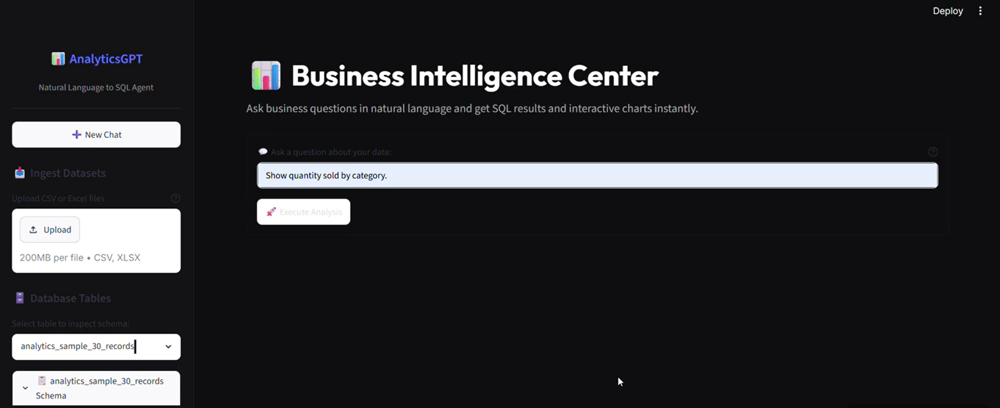
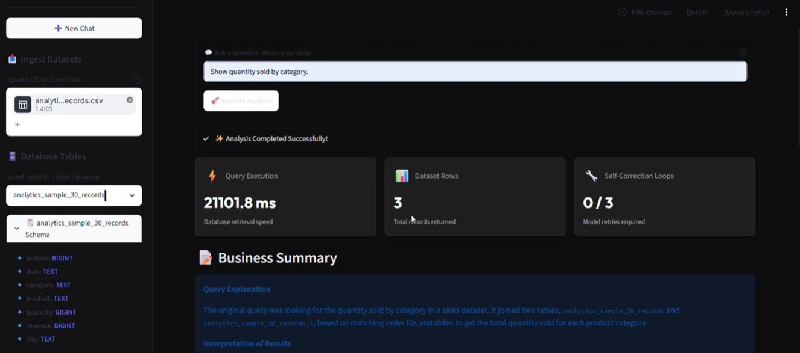
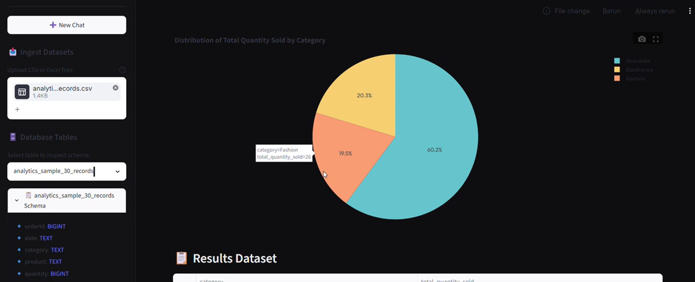
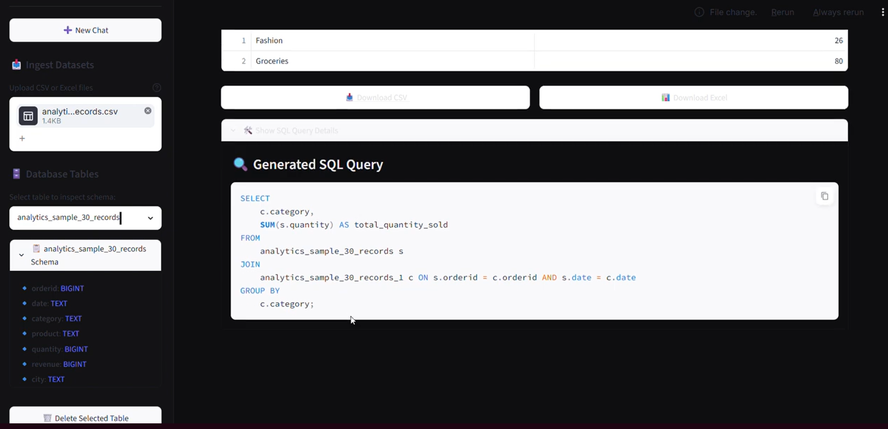

# InsightSQL Agent

**NL-to-SQL Analytics Agent** — Ask business questions in plain English, get safe SQL, interactive charts, and AI-powered insights.

[](https://www.python.org/)
[](https://streamlit.io/)
[](https://www.sqlite.org/)
[](https://ollama.com/)
[](https://www.langgraph.ai/)

---

## Demo Video

https://youtu.be/s5QdFiCZPCc

---

## Project Screenshots

<table>
  <tr>
    <td></td>
    <td></td>
    <td></td>
    <td></td>
  </tr>
</table>

---

## Project Overview

AnalyticsGPT converts natural language questions into SQL using a local Ollama LLM. It automatically discovers schema from uploaded data, validates SQL with a safety layer, executes the query on a read-only SQLite connection, and shows the result with charts and explanations.

---

## Features

- Natural language to SQL conversion
- CSV and Excel dataset ingestion
- Dynamic schema discovery
- Read-only SQLite execution
- SQL safety validation to block dangerous statements
- Automatic chart visualization
- Business explanation generation
- Download results as CSV/Excel
- Persistent query history
- Streamlit dashboard UI

---

## System Architecture

The application follows a secure workflow:

1. Upload CSV/Excel files
2. Discover database schema
3. Generate SQL via Ollama
4. Validate SQL for safety
5. Execute read-only query
6. Display results, charts, and explanations

Key components:
- `app.py` — Streamlit entrypoint
- `agent/` — LLM workflow and retries
- `services/` — database, upload, and Ollama integration
- `tools/` — SQL validation, schema formatting, and chart generation
- `ui/` — dashboard rendering and sidebar controls

---

## Tech Stack

- **Frontend:** Streamlit
- **Database:** SQLite
- **AI:** Ollama local LLM
- **Data:** Pandas
- **Charts:** Plotly
- **Testing:** pytest

---

## Project Structure

```text
analytics-agent/
|-- app.py
|-- requirements.txt
|-- .env.example
|-- database/
|   |-- db_manager.py
|-- uploads/
|-- agent/
|   |-- state.py
|   |-- prompts.py
|   |-- workflow.py
|   |-- graph.py
|   |-- controller.py
|   |-- retry_logic.py
|-- tools/
|   |-- schema_tool.py
|   |-- validator.py
|   |-- sql_tool.py
|   |-- chart_tool.py
|   |-- explanation_tool.py
|-- services/
|   |-- upload_service.py
|   |-- sqlite_service.py
|   |-- history_service.py
|   |-- llm_service.py
|-- ui/
|   |-- sidebar.py
|   |-- dashboard.py
|   |-- components.py
|-- docs/
|   |-- AGENT_FLOW.md
|   |-- AI_USAGE_NOTE.md
|   |-- PROMPTS.md
|   |-- TEST_CASES.md
|-- tests/
|-- uploads/
```

---

## Quick Start

### 1. Install

```powershell
cd "E:\NL to SQL\NL to SQL"
python -m venv venv
& "E:\NL to SQL\venv\Scripts\Activate.ps1"
pip install -r requirements.txt
```

### 2. LLM Setup

Install and start Ollama, then pull a model:

```powershell
ollama pull llama3.2:1b
```

### 3. Configure Environment

Create `.env` based on `.env.example` and set:

```env
OLLAMA_BASE_URL=http://localhost:11434
OLLAMA_MODEL=llama3.2:1b
DATABASE_PATH=database/user_data.db
LOG_LEVEL=INFO
```

### 4. Run

```powershell
streamlit run app.py
```

Open:

```text
http://localhost:8501
```

---

## Sample Questions

- Show total revenue by Category
- What is the total quantity sold by City?
- Show revenue by Product
- What are the top products by revenue?
- How many orders were placed in each City?

---

## Tests

Run the automated test suite:

```powershell
pytest tests/
```

The existing suite covers upload sanitization, SQL validation, query execution, and agent retry behavior.

---

## Security

- Only `SELECT` and `WITH` queries are allowed
- Mutating SQL is blocked (`INSERT`, `UPDATE`, `DELETE`, `DROP`, `ALTER`, `TRUNCATE`)
- The query engine uses a read-only SQLite connection for safety
- Multiple statements are rejected

---

## Environment Variables

Copy `.env.example` to `.env` and configure:

- `OLLAMA_BASE_URL` — local Ollama server URL
- `OLLAMA_MODEL` — model name, e.g. `llama3.2:1b`
- `DATABASE_PATH` — SQLite path
- `LOG_LEVEL` — log verbosity

---

## Documentation

- `docs/PROMPTS.md` — prompt templates used by the agent
- `docs/AI_USAGE_NOTE.md` — prompt engineering and AI behavior notes
- `docs/AGENT_FLOW.md` — workflow and agent loop design
- `docs/TEST_CASES.md` — happy-path test case documentation

---

## Future Improvements

- Advanced CSV cleaning and normalization
- User authentication and multi-user support
- Cloud deployment and remote hosting

---

## 📌 Tech Stack

- Python
- Streamlit
- LangGraph
- SQLite
- Pandas
- Plotly
- Ollama