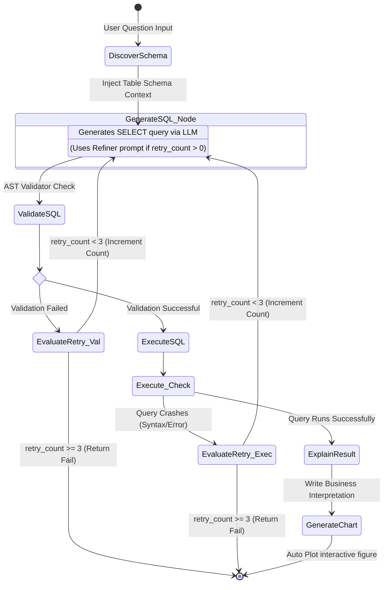

# Agent Execution Flow: AnalyticsGPT

This document details the node-by-node execution lifecycle of the AnalyticsGPT LangGraph agent and describes how self-correcting retries are managed.

## 1. LangGraph State Machine
The agent execution follows the flowchart below:

---

## 2. Step-by-Step Node Explanations

### 1. `discover_schema`
- **Action**: Queries the SQLite database inspector (`sqlite_master` catalog) to fetch names of all user uploaded tables and columns.
- **State Updates**: Injects the formatted text representation of the schema into `state["schema"]`.

### 2. `generate_sql`
- **Action**: Injects the schema and user question into the LLM system prompt.
- **Branching**:
  - **First attempt (retry_count == 0)**: Injects the standard generation prompt.
  - **Debugging attempts (retry_count > 0)**: Injects the last attempted SQL query and the exact validation/execution error message back to the LLM (refiner prompt).
- **State Updates**: Extracts and saves the raw SELECT query into `state["generated_sql"]` and appends it to `state["sql_history"]`.

### 3. `validate_sql`
- **Action**: Invokes the `sqlparse` lexical analyzer. Ensures the query is read-only (`SELECT` or `WITH`) and does not contain any mutation keywords (e.g., `INSERT`, `DROP`).
- **Branching**:
  - **Success**: Updates `state["success"] = True` and routes to `execute_sql`.
  - **Failure**: Captures the validation error message, increments `state["retry_count"]` by 1, sets `state["success"] = False`, and evaluates retries.

### 4. `execute_sql`
- **Action**: Connects to SQLite via the read-only file URI interface (`mode=ro`) and attempts to execute the query as a Pandas DataFrame.
- **Branching**:
  - **Success**: Saves the resulting DataFrame to `state["data"]`, updates `state["success"] = True`, and routes to `explain_result`.
  - **Failure**: Captures the database driver error, increments `state["retry_count"]` by 1, sets `state["success"] = False`, and routes to `generate_sql` for debug refinement.

### 5. `explain_result`
- **Action**: Formats a snippet of the returned rows and columns in Markdown. Passes it alongside the user question and the executed SQL statement to the LLM to get a clear narrative.
- **State Updates**: Saves the text summary to `state["explanation"]`.

### 6. `generate_chart`
- **Action**: Analyzes the schema and data types inside `state["data"]`. Based on heuristics (such as column count and unique record frequencies), generates a line, bar, pie, or scatter Plotly figure.
- **State Updates**: Saves the figure object into `state["visualization"]`.
