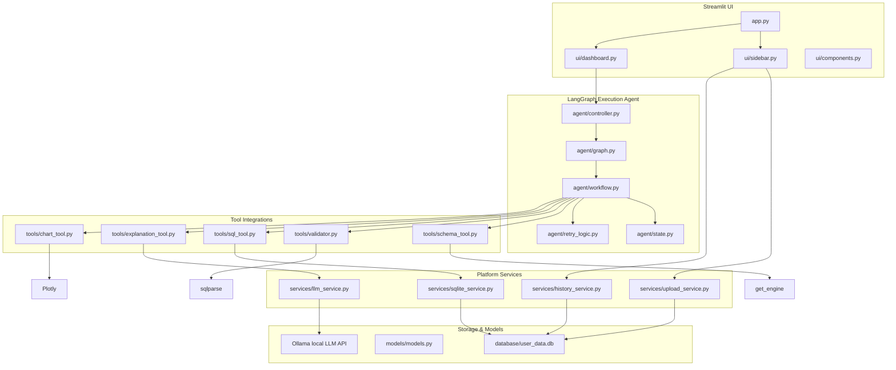

# System Architecture: AnalyticsGPT

This document details the module design, data flow, and security layers implemented in AnalyticsGPT.

## 1. System Module Relationships
The following block architecture illustrates how components are decoupled:

---

## 2. Component Design Specifications

### User Interface (Streamlit)
The frontend utilizes a modular structure. `app.py` acts as the root orchestrator:
- **`sidebar.py`**: Manages the upload input files, registers new tables into the engine, displays tables' structural metadata columns, and displays past queries.
- **`dashboard.py`**: Reads prompt triggers, initializes the LangGraph stream, visualizes final chart figures, displays tables of the resulting datasets, and renders copy-friendly SQL commands.

### Agent Workflow (LangGraph)
Uses Python's `langgraph` framework to orchestrate query processing. States are managed inside an `AgentState` TypedDict:
- Linear execution flows from Schema discovery to SQL generation, validation, and database queries.
- Incorporates conditional routing hooks for self-healing error cycles. If a query syntax exception occurs, control flows back to SQL refinement.

### Security Layers (sqlparse & URI mode=ro)
We maintain a strict double-layer read-only constraint:
1. **Static AST Analysis**: The query string is processed by `sqlparse`, separating and removing comments. It verifies that only `SELECT` and `WITH` query types are present.
2. **SQLite Connection Constraint**: Database queries execute over a connection opened in read-only mode (`file:db?mode=ro`), preventing query-injection mutations directly at the SQLite driver layer.
